# Projects

Welcome to my portfolio,

*Where creativity meets innovation!*

Within these sections, you'll find a diverse showcase of
my projects spanning various domains, each a testament to my passion for technology and software development.

Join me on this journey through a portfolio that encapsulates a spectrum of my technical prowess and showcases
the creativity embedded in each endeavor.

## Qt Framework

Incorporating the Qt into my projects has been a transformative experience, seamlessly merging the robustness
of C++ with the versatility of Python. Leveraging Qt's cross-platform capabilities and rich set of tools, my applications
achieve a harmonious blend of performance, functionality, and user-friendly design. 

### Virtual Tools with Nodes

    

        

            
            <figcaption>Image Caption</figcaption>
        

    

    

        

            
            <figcaption>Image Caption</figcaption>
        

    

!!! note ""
    My work in virtual scripting with nodes, a work-in-progress project, holds dual significance as a key
    component of my college final project.

This is a tool editor, where tools are visualized as nodes,
offering a user-friendly interface for effortless customization. 

Noteworthy features include the incorporation of scriptable extensions, powered by Python,
allowing for dynamic and tailored tool enhancements.

## Blender 3D Addons

Within the realm of 3D design and animation, my exploration extends to the development of Blender 3D Addons.
With a keen eye for addressing specific needs in the creative process, these addons introduce new tools, features,
and automation, amplifying the capabilities of Blender for artists and animators

### Custom Tools - Generative Rigs

    

        

            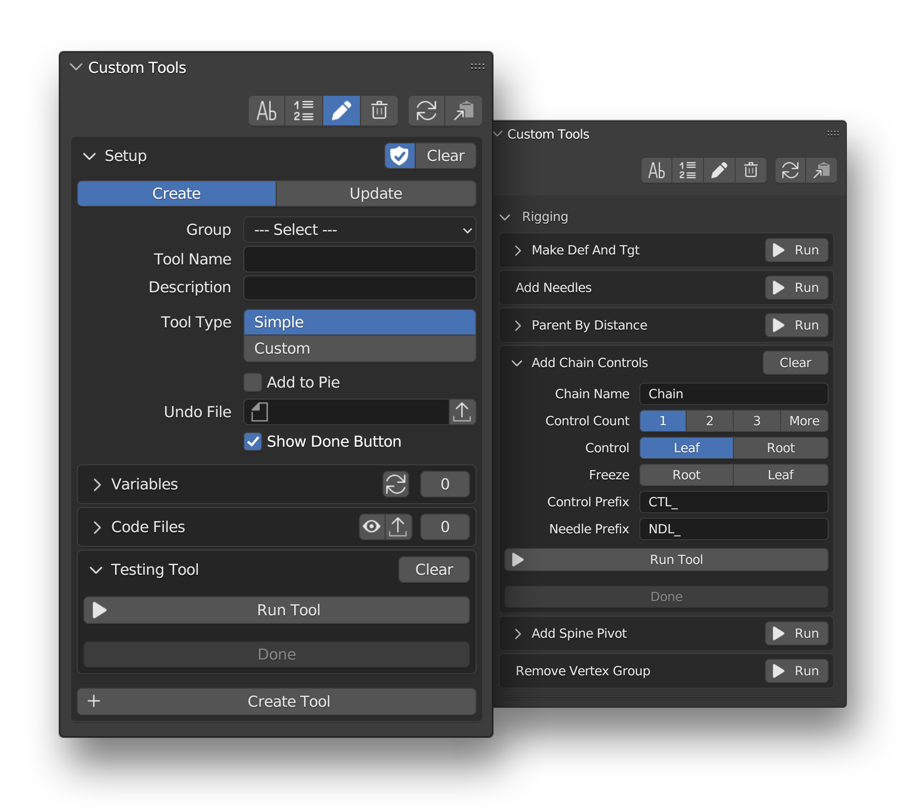
            <figcaption>Custom Rigging Tools Blender Addon</figcaption>
        

    

    

        

            
            <figcaption>Scale Fix Tool in Custom Tools</figcaption>
        

    

    

        

            
            <figcaption>Twist and Tweak Tool in Custom Tools</figcaption>
        

    

    

        

            
            <figcaption>Generative Spine Tools in Custom Tools</figcaption>
        

    

This add-on help in creating other tools, those tools automatically available to all
the instances of blender by hiding the complex build/refeshing work itself.

??? note "Tools Created By This Addon"

    List of main tools created:

    - **Reset Constraints -** to fix the retargeting of targets in bone constaints, especially when scaling.
    - **Twist & Tweak -** to generate customizable twists and tweak in any rig.
    - **Add Chain Controls -** powerful tool for hendling bone chains with many options.
    - **Add Spine Pivot -** to generate a [biped spine](https://www.youtube.com/watch?v=-Wm_WVcbxEM) with swichable pivot.

    and, many more. 

### CUI - Custom UI for Rigs

    

        

            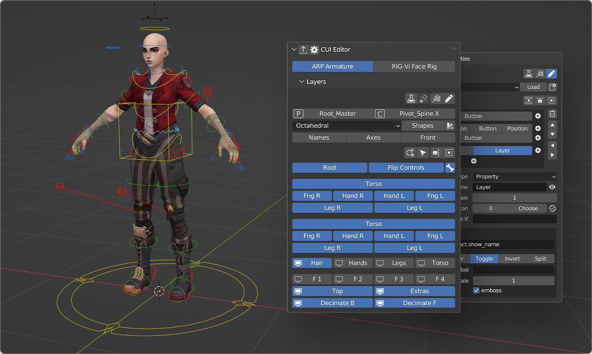
            <figcaption>Custom Rig UI Blender Addon</figcaption>
        

    

    

        

            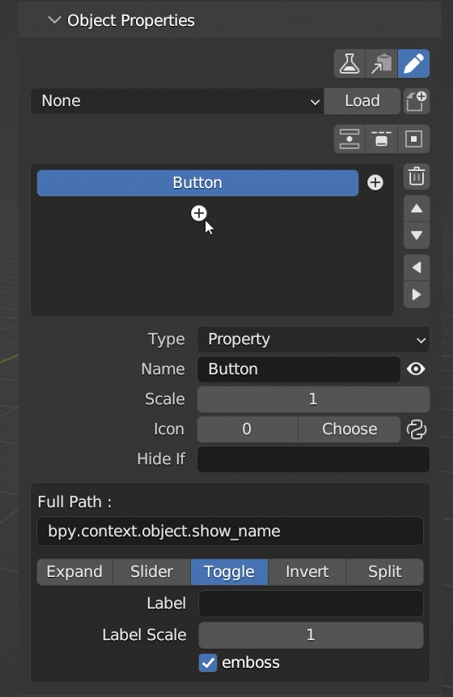
            <figcaption>Button Editing in CUI Addon</figcaption>
        

    

    

        

            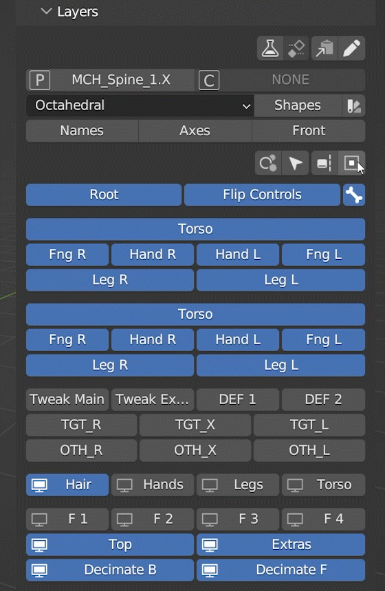
            <figcaption>Interface Options in CUI Addon</figcaption>
        

    

This is a powerful tool for creating user interface of the rig. this tool lets user to link any path to button
(all widgets in blender have the full path in context menu), even from other editor like geometry nodes and shader editor.

### GLink - Live Link Graphs

    

        

            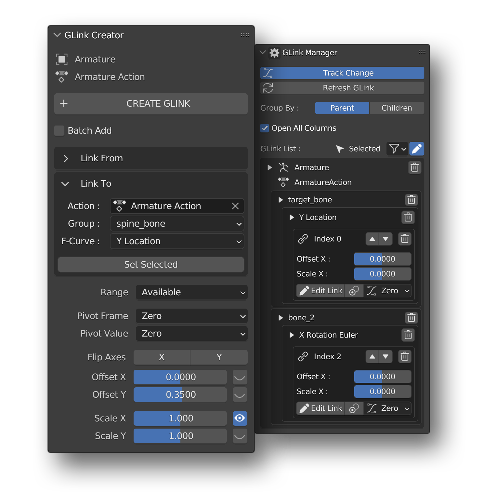
            <figcaption>Graph Link Blender Addon</figcaption>
        

    

    

        

            
            <figcaption>Graph Update Demo of GLink Addon</figcaption>
        

    

    

        

            
            <figcaption>GLink Addon for Space Switching</figcaption>
        

    

This Addon helps user to automatically update f-curves in blender graph editor, which is helpful in when using *space switching techniques* like - `Aim Space` and `World Space`.

This also include **Glink Manager**, which helps in managing lots of graph-links, example - using this in create walk cycle, linking one side to another.

## WebApp Using npm/Webpack

Venturing into the world of web development, my WebApp Using NPM Packages section underscores the utilization of Node Package Manager (NPM).

### Website for Levins Pharmadeals Pvt
<figure markdown>
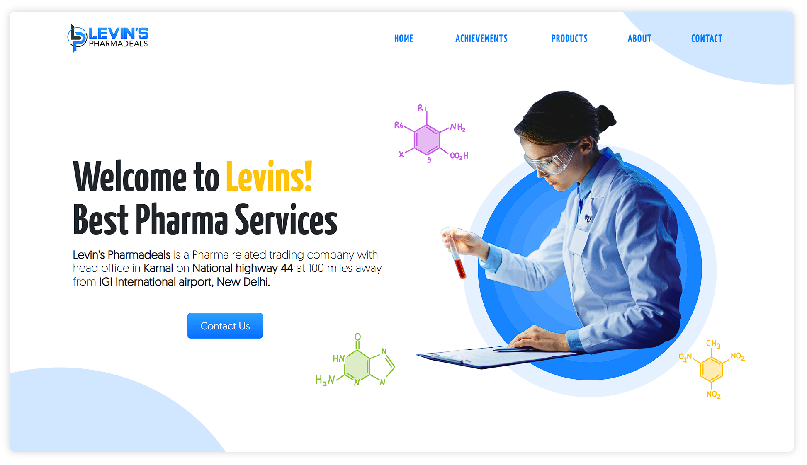
<figcaption>Home Page of Levins Website</figcaption>
</figure>

**[Checkout Live Demo](http://website-demo-levins.vercel.app/)**

I created this website for [Levins Pharmadeals Pvt](https://lpil.in/). This website contain images in .svg format which helps in scaling and animation.

??? note "Technical Details"

    List of technologies used in this project:

    - **Webpack** - for creating the build of project.
    - **Bootstrap** - for creating custom theme for website.
    - **SASS** - for simplified CSS code generation.
    
    see [package.json](https://github.com/mohitsainiknl/website_demo_levins/blob/master/package.json) for more info

### Website for Limeless Media Pvt

<figure markdown>

<figcaption>Home Page of Limeless Website</figcaption>
</figure>

**[Checkout Live Demo](http://website-demo-limeless.vercel.app/)**

And this website is created for [Limeless Media Pvt](https://www.linkedin.com/company/limeless-media/).

??? note "Technical Details"

    List of technologies used in this project:

    - **Webpack** - for creating the build of project.
    - **Bootstrap** - for creating custom theme for website.
    - **SASS** - for simplified CSS code generation.
    
    see [package.json](https://github.com/mohitsainiknl/website_demo_limeless/blob/master/package.json) for more info

## Java Swing Applications

Delving into the realm of desktop application development, the Java Swing Applications section showcases my proficiency
in crafting intuitive and interactive user interfaces using the Java Swing framework.

### MS Paint

    

        

            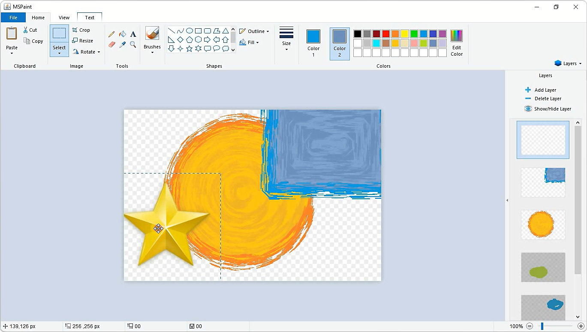
            <figcaption>User Interface of Paint Project</figcaption>
        

    

    

        

            <iframe width="560" height="315" src="https://www.youtube.com/embed/OcuZua8UmmA?si=FGRSUZsSbG6NPsEa" title="YouTube video player" frameborder="0" allow="accelerometer; autoplay; clipboard-write; encrypted-media; gyroscope; picture-in-picture; web-share" allowfullscreen>
            </iframe>
            <figcaption>Youtube Video of Paint Project</figcaption>
        

    

**[Checkout Repository](https://github.com/mohitsainiknl/MSPaint)**

I tried to upgrade Microsoft Paint, and developed it in JavaSE with Swing framework.
Features:

- Can use Layers and Filters
- PNG support (without losing transparency)
- Support Windows, MacOS and Linux

[Download exe/jar files](https://github.com/mohitsainiknl/MSPaint/tree/master/publish) (Reqire JavaSE to run). 

### Snake Game

    

        

            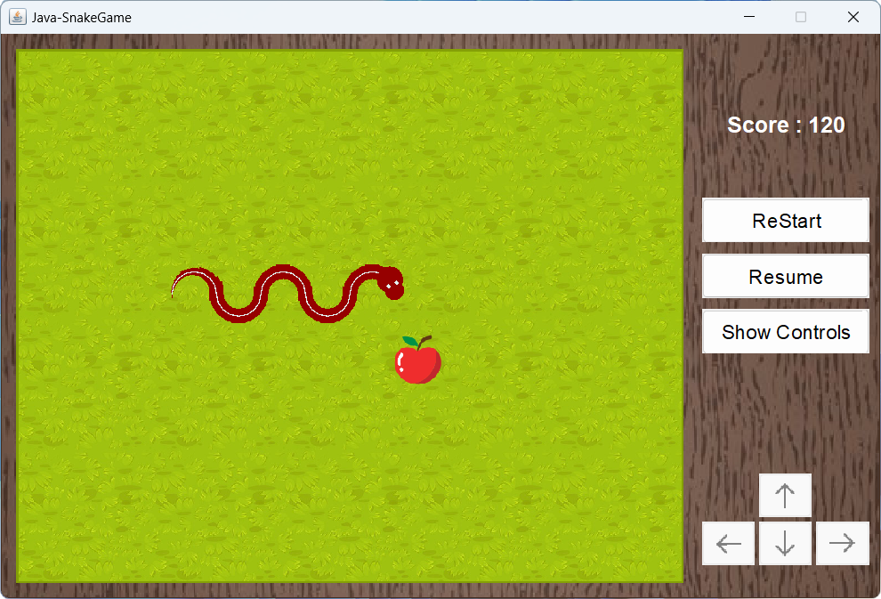
            <figcaption>User Interface of Snake Game Project</figcaption>
        

    

    

        

            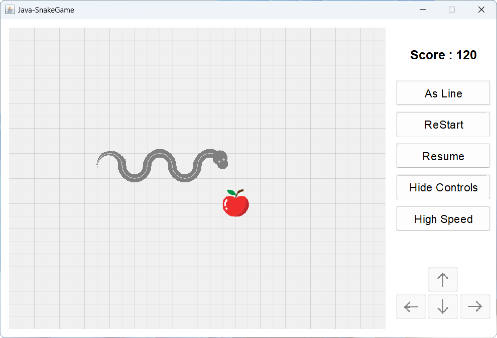
            <figcaption>Graph View of Snake Game</figcaption>
        

    

    

        

            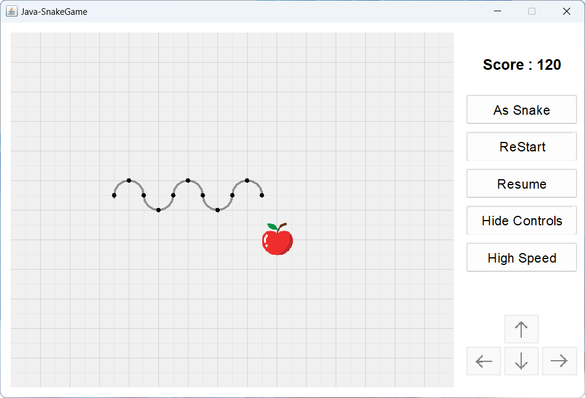
            <figcaption>Snake as Line in Snake Game</figcaption>
        

    

    

        

            <iframe width="560" height="315" style="align-self: center;"src="https://www.youtube-nocookie.com/embed/UuUIlnP-P94?si=h-bptrCjxjMr-HPX" title="YouTube video player" frameborder="0" allow="accelerometer; clipboard-write; encrypted-media; gyroscope;" allowfullscreen>
            </iframe>
        <figcaption>Youtube Video of This Project</figcaption>
        

    

*Challenge your reflexes with the classic Snake Game!*

If you want to know, "How's the snake moving in the JPanel?", may this Show Controls option will help you. Snake can move in
both light and dark colored lines, as shown in image above. Moreover, you can also change the speed of the snake, here.

### MS Notepad

    

        

            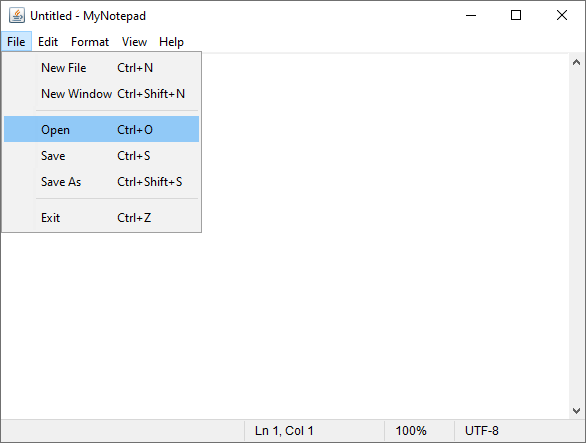
            <figcaption>User Interface of Notepad Project</figcaption>
        

    

    

        

            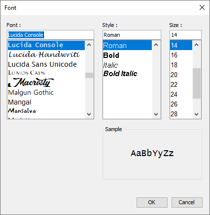
            <figcaption>Font Dialog for Font Customization</figcaption>
        

    

    

        

            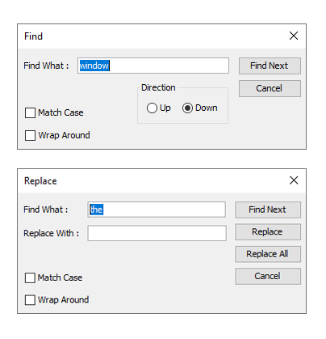
            <figcaption>Find and Replace Dialogs</figcaption>
        

    

*Witness the simplicity and power of MS Notepad!*

MSNotepad is a simple text editor, with cross platform support, and a basic text-editing program which enables computer
users to create documents. It is light-weight editor which entirely looks like Microsoft Windows' Notepad.
MSNotepad writes the settings of the application in the Settings.txt file, before closing the application. And load it again at the starting of the application.

